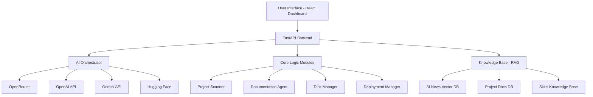

# Zenith Coder 🚀

**An AI-Powered Development Platform for the Modern Vibecoder**

Zenith Coder is an intelligent development platform designed to transform chaotic development environments into organized, automated, and monetization-focused ecosystems. Built specifically for developers with ADHD, it acts as your "second brain" - managing projects, generating documentation, prioritizing tasks, and actively supporting your journey to becoming a top-tier developer.

## 🎯 Vision

Create a seamless development experience where AI handles the organizational overhead, allowing developers to focus on what they do best: creating amazing software. Zenith Coder bridges the gap between brilliant ideas and profitable products.

## ✨ Key Features

### 🔍 **Intelligent Project Organization**
- Automatic scanning of local folders and GitHub repositories
- Duplicate detection and cleanup suggestions
- Project structure standardization
- Real-time synchronization between local and remote repositories

### 📚 **AI-Powered Documentation**
- **Documentation Guardian**: Advanced AI agent that generates and maintains project documentation
- Automatic README.md, CONTRIBUTING.md, and ADR generation
- Continuous monitoring of documentation accuracy
- Intelligent suggestions for documentation improvements

### 📋 **ADHD-Friendly Task Management**
- Large task decomposition into 15-30 minute focused blocks
- AI-powered priority suggestions based on impact and effort
- Visual progress tracking with reward systems
- "Quick wins" identification for motivation boosts

### 💰 **Monetization Support**
- Project analysis for commercial potential
- Freelance opportunity matching using semantic search
- Monetization strategy recommendations (SaaS, API, courses)
- AI industry trend monitoring and insights

### 🚀 **Streamlined Deployment**
- Traefik reverse proxy eliminates port conflicts
- Dynamic DNS integration (DuckDNS) for stable external access
- Docker Compose orchestration
- One-click deployment to VPS

## 🏗️ Architecture



## 🛠️ Tech Stack

- **Backend**: Python 3.11+ with FastAPI
- **Frontend**: React 18+ with TypeScript and Vite
- **Database**: PostgreSQL with Redis caching
- **AI Integration**: OpenRouter, OpenAI, Gemini, Hugging Face
- **Deployment**: Docker Compose + Traefik
- **CI/CD**: GitHub Actions

## 🚀 Quick Start

### Prerequisites
- Docker and Docker Compose
- Python 3.11+
- Node.js 18+
- Git

### Installation

1. **Clone the repository**
   ```bash
   git clone https://github.com/yourusername/zenith-coder.git
   cd zenith-coder
   ```

2. **Set up environment variables**
   ```bash
   cp .env.example .env
   # Edit .env with your API keys and configuration
   ```

3. **Start the development environment**
   ```bash
   docker-compose up -d
   ```

4. **Access the application**
   - Dashboard: http://localhost:3000
   - API Documentation: http://localhost:8000/docs
   - Traefik Dashboard: http://localhost:8080

### Environment Variables

Create a `.env` file with the following variables:

```env
# AI API Keys
OPENAI_API_KEY=your_openai_key_here
CLAUDE_API_KEY=your_claude_key_here
GEMINI_API_KEY=your_gemini_key_here
OPENROUTER_API_KEY=your_openrouter_key_here

# Database
POSTGRES_DB=zenith_coder
POSTGRES_USER=zenith_user
POSTGRES_PASSWORD=your_secure_password

# Redis
REDIS_URL=redis://redis:6379

# GitHub Integration
GITHUB_TOKEN=your_github_token

# DuckDNS (optional)
DUCKDNS_TOKEN=your_duckdns_token
DUCKDNS_DOMAIN=your_domain.duckdns.org
```

## 📖 Documentation

- [Architecture Overview](docs/architecture/overview.md)
- [API Documentation](docs/api/README.md)
- [Deployment Guide](docs/deployment/README.md)
- [Contributing Guidelines](CONTRIBUTING.md)
- [AI Agent Rules](rules.md)

## 🎯 Roadmap

### MVP (Phase 1) - Foundation
- [x] Project structure and CI/CD setup
- [ ] Basic project scanning and organization
- [ ] Simple documentation generation
- [ ] Core dashboard interface

### Phase 2 - Intelligence
- [ ] Advanced AI agent integration
- [ ] Task prioritization and management
- [ ] GitHub synchronization
- [ ] Deployment automation

### Phase 3 - Monetization
- [ ] Freelance opportunity finder
- [ ] Project monetization analysis
- [ ] AI industry insights
- [ ] Community features

### Phase 4 - Scale
- [ ] Multi-user support
- [ ] Advanced analytics
- [ ] Plugin ecosystem
- [ ] Mobile companion app

## 🤝 Contributing

We welcome contributions! Please see our [Contributing Guidelines](CONTRIBUTING.md) for details.

### Development Setup

1. **Backend Development**
   ```bash
   cd backend
   python -m venv venv
   source venv/bin/activate  # On Windows: venv\Scripts\activate
   pip install -r requirements.txt
   uvicorn src.main:app --reload
   ```

2. **Frontend Development**
   ```bash
   cd frontend
   npm install
   npm run dev
   ```

## 📄 License

This project is licensed under the MIT License - see the [LICENSE](LICENSE) file for details.

## 🙏 Acknowledgments

- Inspired by the vibecoding philosophy of effortless flow and professional results
- Built for developers with ADHD who need intelligent organizational support
- Powered by the latest advances in AI and automation

## 📞 Support

- 📧 Email: support@zenithcoder.dev
- 💬 Discord: [Join our community](https://discord.gg/zenithcoder)
- 📖 Documentation: [docs.zenithcoder.dev](https://docs.zenithcoder.dev)
- 🐛 Issues: [GitHub Issues](https://github.com/yourusername/zenith-coder/issues)

---

**Made with ❤️ for developers who want to focus on creating, not organizing.**

