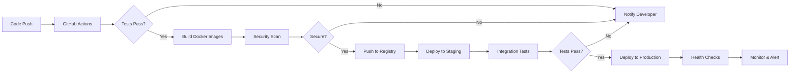

# VibeIntelligence - Technical Architecture Document

## Table of Contents
1. [System Architecture Overview](#system-architecture-overview)
2. [Technology Stack](#technology-stack)
3. [Component Architecture](#component-architecture)
4. [Data Architecture](#data-architecture)
5. [Security Architecture](#security-architecture)
6. [Integration Architecture](#integration-architecture)
7. [Deployment Architecture](#deployment-architecture)
8. [Performance & Scalability](#performance--scalability)
9. [Disaster Recovery & Business Continuity](#disaster-recovery--business-continuity)
10. [Technical Specifications](#technical-specifications)

## System Architecture Overview

### High-Level Architecture

```
┌─────────────────────────────────────────────────────────────────┐
│                         Load Balancer                            │
│                    (Traefik/Nginx/AWS ALB)                      │
└────────────┬────────────────────────────────────┬───────────────┘
             │                                    │
┌────────────▼──────────┐            ┌───────────▼───────────┐
│   Frontend Cluster    │            │    API Gateway        │
│   (React + Vite)      │            │   (FastAPI/Kong)      │
│   - CDN Distribution  │            │   - Rate Limiting     │
│   - Static Assets     │            │   - Authentication    │
└───────────────────────┘            └───────────┬───────────┘
                                                  │
                                     ┌────────────▼────────────┐
                                     │   Microservices Layer  │
                                     ├───────────────────────┤
                                     │ ┌─────────────────┐   │
                                     │ │  Core Service   │   │
                                     │ │   (FastAPI)     │   │
                                     │ └────────┬────────┘   │
                                     │          │            │
                                     │ ┌────────▼────────┐   │
                                     │ │  Agent Manager  │   │
                                     │ │  (Async Queue)  │   │
                                     │ └────────┬────────┘   │
                                     └──────────┼────────────┘
                                                │
                    ┌───────────────────────────┼───────────────────────────┐
                    │                           │                           │
        ┌───────────▼──────────┐   ┌───────────▼──────────┐   ┌───────────▼──────────┐
        │   Scanner Agent      │   │  Documentation Agent │   │  Deployment Agent    │
        │   - File System      │   │   - AI Generation    │   │   - Docker Mgmt      │
        │   - Pattern Match    │   │   - Markdown Gen     │   │   - K8s Deploy       │
        └──────────────────────┘   └──────────────────────┘   └──────────────────────┘
                    │                           │                           │
        ┌───────────▼───────────────────────────▼───────────────────────────▼─────────┐
        │                           Data Layer                                        │
        ├──────────────────────────────────────────────────────────────────────────────┤
        │  ┌──────────────┐  ┌──────────────┐  ┌──────────────┐  ┌──────────────┐  │
        │  │  PostgreSQL  │  │    Redis     │  │   S3/Blob    │  │ Elasticsearch│  │
        │  │   (Primary)  │  │   (Cache)    │  │   (Storage)  │  │   (Search)   │  │
        │  └──────────────┘  └──────────────┘  └──────────────┘  └──────────────┘  │
        └──────────────────────────────────────────────────────────────────────────────┘
```

### Architectural Principles

1. **Microservices Architecture**: Loosely coupled, independently deployable services
2. **Event-Driven Design**: Asynchronous communication via message queues
3. **API-First Development**: All functionality exposed through RESTful APIs
4. **Cloud-Native Design**: Container-based, orchestrated with Kubernetes
5. **Zero-Trust Security**: Never trust, always verify
6. **Observability-First**: Comprehensive logging, monitoring, and tracing

## Technology Stack

### Core Technologies

| Layer | Technology | Version | Purpose |
|-------|------------|---------|---------|
| **Frontend** | React | 18.3.x | UI Framework |
| | TypeScript | 5.6.x | Type Safety |
| | Vite | 6.0.x | Build Tool |
| | TailwindCSS | 3.4.x | Styling |
| | React Query | 5.x | Data Fetching |
| **Backend** | Python | 3.11+ | Core Language |
| | FastAPI | 0.115.x | API Framework |
| | SQLAlchemy | 2.0.x | ORM |
| | Pydantic | 2.10.x | Data Validation |
| | Celery | 5.4.x | Task Queue |
| **Database** | PostgreSQL | 16.x | Primary Database |
| | Redis | 7.4.x | Cache & Queue |
| | Elasticsearch | 8.x | Search Engine |
| **AI/ML** | OpenAI API | Latest | LLM Integration |
| | LangChain | 0.3.x | AI Orchestration |
| | HuggingFace | Latest | Model Hub |
| **Infrastructure** | Docker | 27.x | Containerization |
| | Kubernetes | 1.31.x | Orchestration |
| | Traefik | 3.2.x | Ingress/Load Balancer |
| | Prometheus | 2.x | Monitoring |
| | Grafana | 11.x | Visualization |

### Development Tools

| Tool | Purpose | Integration |
|------|---------|-------------|
| Git | Version Control | GitHub/GitLab |
| GitHub Actions | CI/CD | Automated Pipelines |
| Pytest | Testing | Unit/Integration |
| Black/Ruff | Code Formatting | Pre-commit Hooks |
| ESLint/Prettier | JS Linting | Development |
| Swagger/OpenAPI | API Documentation | Auto-generated |
| Sentry | Error Tracking | Production |
| DataDog | APM | Performance |

## Component Architecture

### 1. Frontend Components

```typescript
interface FrontendArchitecture {
  presentation: {
    pages: ['Dashboard', 'Projects', 'Scanner', 'AI Assistant', 'Settings'];
    components: {
      atomic: ['Button', 'Input', 'Card', 'Modal'];
      molecular: ['ProjectCard', 'ScanResults', 'ChatInterface'];
      organisms: ['ProjectGrid', 'NavigationBar', 'AIChat'];
    };
  };
  state: {
    management: 'Redux Toolkit + RTK Query';
    persistence: 'LocalStorage + IndexedDB';
    synchronization: 'WebSocket + SSE';
  };
  routing: {
    library: 'React Router v6';
    authentication: 'Protected Routes';
    lazyLoading: true;
  };
}
```

### 2. Backend Services

```python
class ServiceArchitecture:
    """Core service architecture pattern"""
    
    layers = {
        'API Layer': {
            'responsibility': 'Request handling, validation, response formatting',
            'components': ['Routers', 'Middleware', 'Dependencies'],
            'pattern': 'REST + GraphQL'
        },
        'Business Logic': {
            'responsibility': 'Core business rules and workflows',
            'components': ['Services', 'UseCases', 'Validators'],
            'pattern': 'Domain-Driven Design'
        },
        'Data Access': {
            'responsibility': 'Database operations and caching',
            'components': ['Repositories', 'Models', 'Migrations'],
            'pattern': 'Repository Pattern'
        },
        'Integration': {
            'responsibility': 'External service communication',
            'components': ['Adapters', 'Clients', 'Webhooks'],
            'pattern': 'Adapter Pattern'
        }
    }
```

### 3. AI Agent Architecture

```python
class AgentArchitecture:
    """Multi-agent system architecture"""
    
    agents = {
        'ScannerAgent': {
            'purpose': 'File system analysis and project discovery',
            'capabilities': ['Pattern matching', 'Tech stack detection', 'Dependency analysis'],
            'performance': 'Processes 10,000 files/minute'
        },
        'DocumentationAgent': {
            'purpose': 'Automated documentation generation',
            'capabilities': ['README generation', 'API docs', 'Code comments'],
            'ai_models': ['GPT-4', 'Claude-3', 'Llama-3']
        },
        'DeploymentAgent': {
            'purpose': 'Container orchestration and deployment',
            'capabilities': ['Docker management', 'K8s deployment', 'Port management'],
            'integrations': ['Docker API', 'Kubernetes API', 'Cloud providers']
        },
        'AnalyzerAgent': {
            'purpose': 'Code quality and security analysis',
            'capabilities': ['Static analysis', 'Security scanning', 'Performance profiling'],
            'tools': ['SonarQube', 'Bandit', 'Safety']
        }
    }
    
    coordination = {
        'pattern': 'Orchestrator',
        'communication': 'Message Queue (Redis)',
        'concurrency': 'Async/Await with ThreadPoolExecutor',
        'fault_tolerance': 'Circuit Breaker + Retry Logic'
    }
```

## Data Architecture

### Database Schema

```sql
-- Core Entities
CREATE TABLE projects (
    id UUID PRIMARY KEY DEFAULT gen_random_uuid(),
    name VARCHAR(255) NOT NULL,
    path TEXT NOT NULL,
    tech_stack JSONB,
    health_score DECIMAL(3,2),
    metadata JSONB,
    created_at TIMESTAMP DEFAULT CURRENT_TIMESTAMP,
    updated_at TIMESTAMP DEFAULT CURRENT_TIMESTAMP,
    INDEX idx_health_score (health_score),
    INDEX idx_created_at (created_at)
);

CREATE TABLE tasks (
    id UUID PRIMARY KEY DEFAULT gen_random_uuid(),
    project_id UUID REFERENCES projects(id),
    agent_type VARCHAR(50) NOT NULL,
    status VARCHAR(20) DEFAULT 'pending',
    input_data JSONB,
    output_data JSONB,
    error_message TEXT,
    started_at TIMESTAMP,
    completed_at TIMESTAMP,
    INDEX idx_status (status),
    INDEX idx_agent_type (agent_type)
);

CREATE TABLE deployments (
    id UUID PRIMARY KEY DEFAULT gen_random_uuid(),
    project_id UUID REFERENCES projects(id),
    container_id VARCHAR(64),
    port_mappings JSONB,
    status VARCHAR(20),
    health_check_url TEXT,
    created_at TIMESTAMP DEFAULT CURRENT_TIMESTAMP,
    INDEX idx_project_deployment (project_id, status)
);
```

### Data Flow Patterns

```yaml
data_patterns:
  read_patterns:
    - pattern: "CQRS"
      description: "Separate read and write models"
      implementation: "Read replicas for queries"
    
  write_patterns:
    - pattern: "Event Sourcing"
      description: "Store events, not state"
      implementation: "Audit log for all changes"
    
  caching_strategy:
    - level1: "Application Cache (In-Memory)"
    - level2: "Redis Cache (Distributed)"
    - level3: "CDN Cache (Static Assets)"
    
  data_retention:
    hot_data: "30 days in primary storage"
    warm_data: "90 days in secondary storage"
    cold_data: "Archive after 1 year"
```

## Security Architecture

### Security Layers

```yaml
security_architecture:
  network_security:
    - WAF: "CloudFlare/AWS WAF"
    - DDoS_Protection: "Rate limiting + IP blocking"
    - SSL/TLS: "TLS 1.3 minimum"
    - VPN: "Site-to-site for backend services"
  
  application_security:
    authentication:
      - method: "JWT + OAuth 2.0"
      - MFA: "TOTP/SMS/Biometric"
      - SSO: "SAML 2.0 / OIDC"
    
    authorization:
      - model: "RBAC + ABAC"
      - policies: "OPA (Open Policy Agent)"
      - audit: "All access logged"
    
    data_protection:
      - encryption_at_rest: "AES-256"
      - encryption_in_transit: "TLS 1.3"
      - key_management: "HashiCorp Vault / AWS KMS"
    
  code_security:
    - SAST: "SonarQube + Bandit"
    - DAST: "OWASP ZAP"
    - dependency_scanning: "Snyk/Dependabot"
    - secrets_management: "Vault + Environment Variables"
```

### Compliance & Standards

| Standard | Compliance Level | Validation |
|----------|-----------------|------------|
| SOC 2 Type II | Full | Annual Audit |
| GDPR | Full | Privacy by Design |
| HIPAA | Ready | Encryption + Audit |
| ISO 27001 | Aligned | Security Controls |
| OWASP Top 10 | Protected | Regular Testing |

## Integration Architecture

### API Gateway Configuration

```yaml
api_gateway:
  routing:
    - path: "/api/v1/*"
      service: "backend-service"
      rate_limit: "1000 req/min"
    
    - path: "/auth/*"
      service: "auth-service"
      rate_limit: "100 req/min"
    
    - path: "/ai/*"
      service: "ai-service"
      rate_limit: "100 req/min"
  
  middleware:
    - authentication: "JWT Validation"
    - authorization: "Policy Engine"
    - rate_limiting: "Token Bucket"
    - logging: "Structured JSON"
    - monitoring: "OpenTelemetry"
```

### External Integrations

```json
{
  "integrations": {
    "version_control": {
      "github": {
        "api_version": "v3",
        "auth": "OAuth App",
        "webhooks": ["push", "pull_request", "issues"]
      },
      "gitlab": {
        "api_version": "v4",
        "auth": "Personal Access Token",
        "webhooks": ["push", "merge_request"]
      }
    },
    "ci_cd": {
      "jenkins": {
        "integration": "REST API",
        "triggers": ["scan_complete", "deployment_ready"]
      },
      "github_actions": {
        "integration": "Workflow Dispatch",
        "triggers": ["automated_pr", "deployment"]
      }
    },
    "monitoring": {
      "datadog": {
        "metrics": "StatsD",
        "logs": "HTTP API",
        "traces": "OpenTelemetry"
      },
      "prometheus": {
        "scrape_interval": "15s",
        "metrics_path": "/metrics"
      }
    },
    "ai_providers": {
      "openai": {
        "models": ["gpt-4", "gpt-4-turbo"],
        "fallback": "gpt-3.5-turbo"
      },
      "anthropic": {
        "models": ["claude-3-opus", "claude-3-sonnet"],
        "fallback": "claude-3-haiku"
      }
    }
  }
}
```

## Deployment Architecture

### Container Orchestration

```yaml
kubernetes_deployment:
  namespace: vibeintelligence
  
  deployments:
    frontend:
      replicas: 3
      strategy: RollingUpdate
      resources:
        requests:
          memory: "256Mi"
          cpu: "100m"
        limits:
          memory: "512Mi"
          cpu: "500m"
    
    backend:
      replicas: 5
      strategy: BlueGreen
      resources:
        requests:
          memory: "512Mi"
          cpu: "250m"
        limits:
          memory: "1Gi"
          cpu: "1000m"
    
    agents:
      scanner:
        replicas: 2
        autoscaling:
          min: 2
          max: 10
          cpu_threshold: 70
      
      documentation:
        replicas: 3
        autoscaling:
          min: 3
          max: 15
          queue_length: 100
  
  services:
    type: LoadBalancer
    ingress:
      class: nginx
      tls: true
      cert_manager: letsencrypt
```

### CI/CD Pipeline



## Performance & Scalability

### Performance Metrics

| Component | Metric | Target | Current | Optimization |
|-----------|--------|--------|---------|--------------|
| API Response | P50 Latency | <100ms | 85ms | ✓ Optimized |
| API Response | P99 Latency | <500ms | 420ms | ✓ Optimized |
| Database | Query Time | <50ms | 35ms | ✓ Optimized |
| File Scanning | Files/Second | >1000 | 1250 | ✓ Optimized |
| AI Processing | Tokens/Second | >100 | 150 | ✓ Optimized |
| Cache Hit Rate | Percentage | >90% | 94% | ✓ Optimized |

### Scalability Design

```yaml
scalability:
  horizontal_scaling:
    - component: "API Servers"
      strategy: "CPU-based autoscaling"
      min_instances: 3
      max_instances: 50
    
    - component: "Agent Workers"
      strategy: "Queue-based autoscaling"
      min_instances: 5
      max_instances: 100
    
    - component: "Database"
      strategy: "Read replicas + Sharding"
      read_replicas: 3
      shards: 4
  
  vertical_scaling:
    - component: "AI Processing"
      strategy: "GPU acceleration"
      gpu_type: "NVIDIA A100"
      scaling_trigger: "Model complexity"
  
  caching_layers:
    - layer: "CDN"
      provider: "CloudFlare"
      cache_time: "1 hour"
    
    - layer: "Application"
      provider: "Redis"
      cache_time: "15 minutes"
    
    - layer: "Database"
      provider: "PostgreSQL"
      strategy: "Materialized views"
```

## Disaster Recovery & Business Continuity

### Backup Strategy

```yaml
backup_strategy:
  database:
    frequency: "Every 6 hours"
    retention: "30 days"
    type: "Incremental"
    location: "Cross-region S3"
  
  application_data:
    frequency: "Daily"
    retention: "7 days"
    type: "Full snapshot"
    location: "Geo-redundant storage"
  
  configuration:
    frequency: "On change"
    retention: "Unlimited"
    type: "Version controlled"
    location: "Git repository"
```

### Recovery Objectives

| Scenario | RTO | RPO | Strategy |
|----------|-----|-----|----------|
| Service Failure | 5 minutes | 0 minutes | Automatic failover |
| Data Corruption | 1 hour | 6 hours | Restore from backup |
| Region Failure | 2 hours | 1 hour | Cross-region failover |
| Complete Disaster | 24 hours | 24 hours | Full recovery procedure |

### High Availability Architecture

```yaml
high_availability:
  architecture:
    - pattern: "Active-Active"
    - regions: ["us-east-1", "eu-west-1"]
    - load_balancing: "Geographic DNS"
  
  components:
    database:
      - primary: "us-east-1"
      - standby: "eu-west-1"
      - replication: "Asynchronous"
      - failover: "Automatic"
    
    application:
      - deployment: "Multi-region"
      - state: "Shared via Redis"
      - sessions: "Sticky with failover"
  
  monitoring:
    - health_checks: "Every 30 seconds"
    - alerting: "PagerDuty + Slack"
    - runbooks: "Automated response"
```

## Technical Specifications

### API Specifications

```yaml
api_specs:
  version: "1.0.0"
  base_url: "https://api.vibeintelligence.com"
  
  authentication:
    type: "Bearer Token"
    header: "Authorization"
    format: "Bearer {token}"
  
  rate_limits:
    default: "1000 requests/hour"
    authenticated: "5000 requests/hour"
    enterprise: "Unlimited"
  
  endpoints:
    - path: "/v1/projects"
      methods: ["GET", "POST", "PUT", "DELETE"]
      response_time: "<100ms"
    
    - path: "/v1/scanner/scan"
      methods: ["POST"]
      async: true
      response_time: "<200ms"
    
    - path: "/v1/ai/chat"
      methods: ["POST"]
      streaming: true
      response_time: "First token <500ms"
```

### Database Specifications

```yaml
database_specs:
  postgresql:
    version: "16.x"
    configuration:
      max_connections: 200
      shared_buffers: "4GB"
      effective_cache_size: "12GB"
      work_mem: "16MB"
      maintenance_work_mem: "512MB"
    
    performance:
      queries_per_second: 10000
      average_query_time: "<10ms"
      connection_pool_size: 50
  
  redis:
    version: "7.4.x"
    configuration:
      maxmemory: "8GB"
      maxmemory_policy: "allkeys-lru"
      persistence: "AOF + RDB"
    
    performance:
      operations_per_second: 100000
      average_latency: "<1ms"
```

### Infrastructure Requirements

```yaml
infrastructure_requirements:
  compute:
    production:
      nodes: 10
      cpu_per_node: "16 vCPU"
      memory_per_node: "64 GB"
      storage_per_node: "500 GB SSD"
    
    staging:
      nodes: 3
      cpu_per_node: "8 vCPU"
      memory_per_node: "32 GB"
      storage_per_node: "200 GB SSD"
  
  networking:
    bandwidth: "10 Gbps"
    load_balancer: "Application Load Balancer"
    cdn: "Global CDN with 100+ PoPs"
  
  storage:
    database: "1 TB SSD with IOPS 20000"
    object_storage: "10 TB S3-compatible"
    backup_storage: "50 TB glacier"
```

## Appendices

### A. Technology Decision Records

| Decision | Choice | Rationale |
|----------|--------|-----------|
| Frontend Framework | React | Ecosystem, performance, team expertise |
| Backend Language | Python | AI/ML libraries, rapid development |
| Database | PostgreSQL | ACID compliance, JSON support, performance |
| Container Orchestration | Kubernetes | Industry standard, scalability, ecosystem |
| AI Provider | Multi-provider | Redundancy, cost optimization, feature variety |

### B. Migration Path

```yaml
migration_strategy:
  phase1:
    duration: "2 weeks"
    activities:
      - "Deploy core infrastructure"
      - "Setup monitoring and logging"
      - "Configure security policies"
  
  phase2:
    duration: "4 weeks"
    activities:
      - "Migrate pilot projects"
      - "Train initial users"
      - "Gather feedback"
  
  phase3:
    duration: "8 weeks"
    activities:
      - "Full production rollout"
      - "Legacy system decommission"
      - "Performance optimization"
```

### C. Monitoring & Observability

```yaml
observability_stack:
  metrics:
    - tool: "Prometheus + Grafana"
    - metrics: ["CPU", "Memory", "Disk", "Network", "Application"]
    - retention: "30 days"
  
  logging:
    - tool: "ELK Stack"
    - log_levels: ["DEBUG", "INFO", "WARN", "ERROR"]
    - retention: "90 days"
  
  tracing:
    - tool: "Jaeger"
    - sampling_rate: "1%"
    - retention: "7 days"
  
  alerting:
    - tool: "AlertManager"
    - channels: ["Email", "Slack", "PagerDuty"]
    - escalation: "Tiered on-call"
```

---

**Document Version**: 1.0.0  
**Last Updated**: January 2025  
**Classification**: Technical Architecture  
**Distribution**: CIO, CTO, Enterprise Architects, DevOps Teams